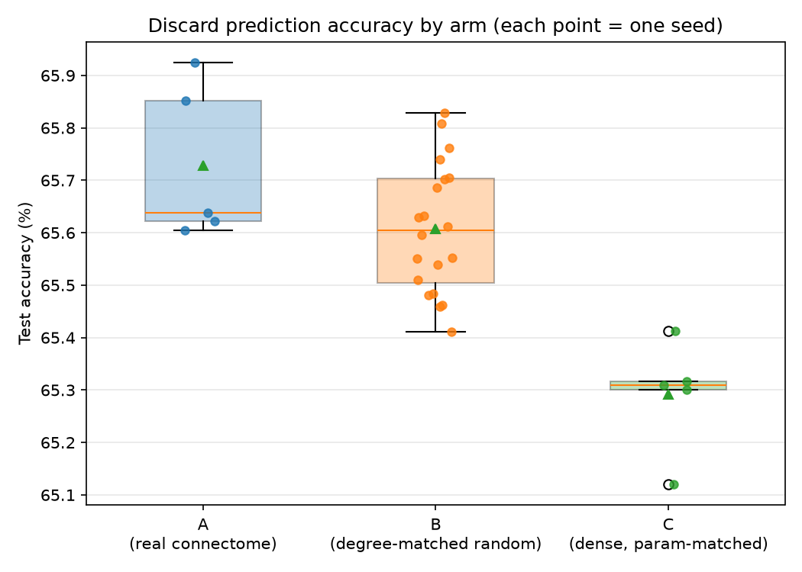

# 果蠅腦 connectome 拓撲 vs 隨機拓撲：喺日本麻雀掉牌預測上嘅對照實驗

## 研究問題

2026 年 Google Research / HHMI Janelia 開源咗雄性果蠅全腦 connectome（16.6 萬粒
neuron、1.25 億個 synapse）。網上出現咗「蠅腦打 Doom/Mario」呢類 demo，但實際上
呢啲 demo 淨係攞 connectome 嘅拓撲做 sparse recurrent network 嘅固定邊，weight
照樣自己訓練——connectome 本身冇提供 synaptic strength，亦冇任何動態活動。

呢個實驗想認真答一條問題：

> 用真果蠅腦 mushroom body（PN→KC→MBON）嘅 sparse connectivity 做 neural
> network 中間層嘅固定結構，喺日本麻雀打牌預測上，會唔會贏過一個 degree 分佈
> 相同但隨機連線嘅結構？

揀 mushroom body 係因為佢喺生物上本身就係聯想學習迴路：PN 輸入 → KC 做 sparse
expansion coding → MBON 讀出，呢個形狀同「手牌狀態 → 打邊隻牌」嘅決策映射講得通。

## 方法

### 1. Connectome mask 提取（Step 1-2）

由 `annotations.feather`（211,577 粒 neuron）用以下定義揀出三層：

| 層 | 定義 | 數量 |
|---|---|---|
| PN | `class == 'ALPN'` 且 type 唔係 `M_` 開頭（排除 multiglomerular） | 387 |
| KC | `type` 開頭係 `KC` | 4063 |
| MBON | `class == 'MBON'` | 97 |

（PN 定義曾經同預期嘅 100-200 有出入，追查後認為係預期數字嚟自單邊腦嘅舊文獻，
male CNS 呢個 dataset 兩邊腦都有，387 大約等於單邊 ~190 x2，已同使用者確認接受。）

由 `connectome-weights-male-cns-v1.0-minconf-0.5.feather`（1.25 億條 edge）
filter `weight >= 5`，抽出 PN→KC（19,832 條非零 edge）同 KC→MBON（33,496 條）
兩個 binary mask。KC 平均 in-degree 4.88（同預期 5-8 貼近）。

Degree-matched random mask：對每一粒 KC，數佢喺真 mask 入面有幾多個 PN input
（設為 k），喺 PN pool 隨機（無放回）抽 k 個；KC→MBON 同理。20 個獨立 seed
（`np.random.default_rng(seed)`）。

### 2. 麻雀 discard decision dataset（Step 3-6）

**資料來源**：`NikkeTryHard/tenhou-to-mjai` 喺 GitHub Releases 派發嘅天鳳鳳凰卓
（houou，高段位對局）MJAI 格式牌譜，2009 年，6897 局。用 `jansou`（開源 Python
mahjong library）嘅 `parse_mjai()` 解析，逐個 event replay 每粒 seat 嘅
concealed hand、meld、discard 記錄。

> **資料使用聲明**：天鳳官方 ToS 講明「一般麻雀應用」需要去信
> support@c-egg.com 查詢。本研究已去信查詢中，喺等回信期間選擇用第三方已整理
> 嘅牌譜繼續 pipeline 開發，屬於已知悉並接受嘅灰色地帶風險，非商業、非公開轉載
> 原始牌譜，僅供個人研究使用。

處理咗 3000 局（MAX_FILES=3000），得 **1,556,465 個掉牌決策**（DISCARD +
RIICHI_DISCARD），按 `match_id` 分 train(2400 局) / val(300 局) / test(300 局)，
80/10/10，確保同一局唔會撕開兩邊。

### 3. Feature encoding（Step 4）

每個決策編碼做 `(32, 34)` 嘅 binary tensor（32 個 channel，34 = 麻雀牌種數）：

- Channel 0-3：自己手牌 count thermometer（>=1/2/3/4）
- Channel 4：自己手牌有冇紅五
- Channel 5-8：自己已 meld 嘅牌 count thermometer
- Channel 9-24：自己 + 順時針 3 個對手嘅牌河 count thermometer（4 人 x 4 plane）
- Channel 25：現正生效嘅 dora 牌
- Channel 26-27：場風、自風（one-hot）
- Channel 28-31：4 個人嘅 riichi 狀態（broadcast）

### 4. 模型架構

```
麻雀 feature (32 x 34)
  -> Conv1d 前端（2 層，64 channel，ReLU）
  -> Linear -> PN 層（387）
  -> MaskedLinear(PN -> KC)
  -> ReLU
  -> MaskedLinear(KC -> MBON)
  -> Linear -> 34 logits
```

`MaskedLinear` 係普通 `nn.Linear`，但 weight 逐元素乘一個唔會被訓練嘅 mask
buffer，masked-out 嘅位永遠係 0。

### 5. 三條 arm

| Arm | 中間層結構 | 有效參數（非零 weight + bias） |
|---|---|---|
| A | 真 connectome mask（387→4063→97，稀疏） | 57,488 |
| B | Degree-matched random mask，20 個 seed | 57,488（同 A） |
| C | Dense（無 mask），hidden dim 縮到 118（387→118→97，全連接） | 57,488（同 A/B） |

三條 arm 嘅「有效參數量」刻意夾到一樣，等準確度差異可以歸因於「連接方式」，
而唔係「邊個 arm 本身多啲參數」。Arm C 嘅 118 呢個 hidden dim 係解方程式
`485H + 97 = 57488` 算出嚟，唔係湊出嚟嘅。

### 6. 訓練

- Batch size 1024，Adam，lr=1e-3
- 最多 20 epoch，val accuracy 連續 3 個 epoch 冇進步就 early stop，用返
  val_acc 最好嗰個 epoch 嘅 weight 去 evaluate test set
- Arm A：5 個 seed（真 mask 唔變，5 個 run 淨係 model init/data order 唔同）
- Arm B：20 個 seed（每個 seed 對應一條唔同嘅 random mask，同時攞嚟做
  model init/data order）
- Arm C：5 個 seed（dense 架構，5 個 run 淨係 model init/data order 唔同）

## 結果



| Arm | n (seed 數) | mean test_acc | std | min | max |
|---|---|---|---|---|---|
| A（真 connectome） | 5 | 65.73% | 0.15% | 65.60% | 65.92% |
| B（degree-matched random） | 20 | 65.61% | 0.12% | 65.41% | 65.83% |
| C（dense，param-matched） | 5 | 65.29% | 0.11% | 65.12% | 65.41% |

### 統計檢定（Welch's t-test + permutation test，10 萬次重抽樣）

| 比較 | 差距 | Welch t | p (t-test) | p (permutation) | Cohen's d |
|---|---|---|---|---|---|
| A vs B | +0.12pp | 1.68 | 0.149 | 0.073 | 0.88 |
| A vs C | +0.44pp | 5.35 | 0.001 | 0.006 | 3.38 |
| B vs C | +0.32pp | 5.76 | 0.0007 | <0.0001 | 2.75 |

（作為外部參照：discard prediction 呢類 task，文獻上 Bakuuchi baseline
62.1%、CNN-based 方法 68.8-70.44%、Suphx 76.7%。本實驗嘅 65-66% 落喺合理
範圍，證明 pipeline 本身健康，但呢個絕對數值唔係本研究嘅重點——三條 arm
用緊完全一樣嘅架構/數據/訓練程序，比較係內部相對嘅。）

## 結論

實驗問題可以拆做兩層，分別有清晰答案：

1. **「稀疏擴張結構」本身有冇用？** —— 有。Arm A、Arm B（都係 387→4063→97
   嘅稀疏結構）明顯贏過 Arm C（387→118→97 嘅密集結構），兩個比較都
   p<0.01、效應量巨大（d>2.7）。即係話，將中間層擴張做成千上萬粒、稀疏連接
   嘅設計本身就有實質著數，唔理呢啲連接係咪抄真嘅生物接線圖。

2. **「果蠅嗰個特定接線圖案」本身有冇用？** —— 冇睇到有。Arm A vs Arm B
   嘅差距（0.12 個百分點）統計上唔顯著（t-test p=0.149，permutation
   p=0.073）。即係話，喺呢個 task、呢個規模下，**冇證據支持用真果蠅腦嘅
   具體 PN-KC 接線圖案，會贏過一個 degree 分佈相同嘅隨機接線圖案**。

呢個結果同研究開頭嘅預期（「三條 arm 差唔多」都算係答案）一致，但比「完全
冇分別」更精細：分別喺於「形狀」（sparse expansion），唔喺於「圖案」
（specific wiring）。

## Follow-up 實驗：Dataset Scaling

上面 A/B/C 三條 arm 用緊嘅係 2009 年一年、3000 檔、155 萬個決策。跑完之後
另外開咗條獨立嘅問題：**淨係加大 training data（唔改連接結構），Arm A
會唔會打得叻好多？**——呢條同「邊種連接結構好」係兩個獨立問題，用獨立嘅
script/檔案做（`*_scaled` 系列），冇覆蓋原本嗰批用嚟做 A/B/C 對照嘅
dataset/結果。

**做法**：落多 2010-2018 共 9 年嘅天鳳鳳凰卓牌譜（同 2009 年一樣嘅嚟源），
每年攞頭 3000 檔（同原本一致嘅 per-year cap），10 年一齊夾埋，令
train/val/test 三邊都有齊 10 年嘅代表性（唔會出現淨用舊年代 train、新年代
test 嘅 meta drift）。得 15,470,316 個決策，10 倍於原本。淨係 train
Arm A（真 connectome），5 個 seed，同原本 experiment_results.csv 入面
嗰 5 個 Arm A seed 比較。

**結果**：

| Dataset | 決策數 | mean test_acc | std | n(seed) |
|---|---|---|---|---|
| 原本（2009 年，3000 檔） | 1,556,465 | 65.73% | 0.15% | 5 |
| Scaled（2009-2018，30000 檔） | 15,470,316 | **69.72%** | 0.04% | 5 |

差距 = **+3.99 個百分點**，Welch t = 58.16（p≈0），permutation test（10 萬次
重抽樣）p = 0.0024，Cohen's d = 36.78（比 A vs C 嗰個「巨大」效應量仲要
大成 10 倍）。5 個 seed 之間嘅 std 仲細咗（0.15%→0.04%），結果非常一致。

**結論**：喺呢個 task 度，「加大 training data」對準確度嘅影響，遠遠大過
「用邊種連接結構」（+4pp vs A-B 嗰 0.12pp 唔顯著嘅差距）。連接拓撲決定
「起跑點」，但 data 規模先係真正嘅樽頸——同深度學習領域嘅一般認知一致，
但透過呢個乾淨嘅對照實驗喺呢個特定 task 上親身驗證咗一次。

跑法/產出見下面「檔案索引」入面 `*_scaled` 果幾行。（呢個 discard-only
Arm A model 曾經有個部署用嘅 checkpoint `model_arm_a.pt`，俾一個獨立嘅
「單一決策分析器」app 用；嗰個 app 同呢個 checkpoint 之後決定唔要，見
下面「已移除」一節。）

**Action model 都做埋一次**：`game_app.py`（成局遊戲）嘅
叫牌/立直/自摸/防守建議，用緊嘅其實係另一個 model
（`action_model_arm_a.pt`），訓練資料同上面嗰個純掉牌 dataset 唔同（連
pon/chii/kan/riichi/ron/pass 都有）。用同一批 2009-2018 牌譜，經
`build_action_dataset_scaled.py`（replay+oracle，見 `validate_replay.py`）
砌出 19,656,702 個原始決策，PASS 20% subsample 後 17,069,986 個，重新
train 過：

| Head | 原本（2009 年） | Scaled（2009-2018） |
|---|---|---|
| self_type | – | 98.74% |
| discard | – | 68.93% |
| reaction | – | 88.22% |
| **overall** | – | **84.10%** |

（原本嗰個部署 checkpoint 冇留低獨立嘅 test accuracy 記錄，所以呢度冇得
直接對比個百分比，但用嘅係完全同一套 pipeline/config，唯一分別係 dataset
大細——依原理應該跟隨返上面純掉牌 model 見到嘅同一個方向：data 越多，
model 越叻。）呢個 checkpoint 已經部署緊。

**做呢兩個 scaling job 期間踩過嘅坑**：一次過將 1500-2000 萬行、每行帶
nested list 欄位（hand_counts/meld_counts/discard_counts 等）嘅
Python dict 砌成一個 polars DataFrame，會將成個 dataset 喺記憶體度複製
好幾份（filter/concat/sort 各一份），喺 32GB RAM 嘅機度俾 OOM kill 咗
兩次。修正做法：（1）逐年分開砌、逐年即刻寫落 disk 做 cache（令個 script
可以斷咗續返，唔使由頭嚟過），（2）最後 subsample 嗰步用 numpy 揀 index
再一次過 filter，唔好分開 filter 兩份再 concat 再 sort。

## 已移除：單一決策分析器（`app.py`）

Phase 1/2 曾經有個獨立嘅「單一決策分析器」Streamlit app（`src/app.py`，
淨係俾一手牌 + 場況、睇 model 點排名各個選項），用嗰陣要另外部署一個
discard-only 嘅 checkpoint（`train_and_save_model.py` → `model_arm_a.pt`）。
之後決定淨係保留 `game_app.py`（可以真係打落去嘅遊戲），單一決策分析器
用途重疊、冧多咗，所以移除埋 `app.py`、`inference.py`（佢專用嘅 model
wrapper）、`call_options.py`（佢專用嘅手動 pon/chii/kan 組合枚舉，
`game_app.py` 用緊 `jansou` 真正嘅合法選項，唔需要呢個）同
`train_and_save_model.py`/`model_arm_a.pt`。經過核對，呢幾個檔案冇被
`game_app.py` 或者其他 pipeline script 用過，移除唔影響任何研究結果
（A/B/C 對照、scaling 實驗都唔靠呢個 checkpoint）。

## 限制

- **A vs B 嘅比較唔對稱**：A 得一條真 mask，5 個 run 之間淨係 model
  init/data order 唔同；B 有 20 條唔同嘅 mask。如果想對「A vs B 冇顯著分別」
  呢個結論更有信心，應該加多 A 嘅 seed 數（例如都加到 20），令兩邊嘅
  統計力度對稱。
- **Degree-matched random mask 淨係夾咗「每粒 KC 有幾多個 PN input」（in-degree）**，
  冇夾實際邊個 PN 特別多產出（fan-out）。真實 connectome 入面，唔同 PN
  嘅出度分佈可能好唔平均；random mask 打散咗呢種異質性。呢個係實驗刻意嘅
  設計（保持乾淨嘅對照），唔係漏洞，但解讀結論時要記住呢點。
- **牌譜資料**：A/B/C 三條 arm 對照淨係用咗 2009 年，未涵蓋唔同年代嘅打法
  meta 變化（下面「Follow-up 實驗」加咗 2010-2018，但淨係用嚟 train
  Arm A，冇再重做 A vs B 嘅拓撲對照）；資料嚟源嘅 ToS 狀態未有官方書面
  確認（見上面「資料使用聲明」）。
- **絕對準確度**：65-66% 落喺文獻合理範圍，但個 model（Conv1d 前端 + 32
  channel 手作 feature）本身冇經過大幅調優，唔應該用嚟同 SOTA model 比較
  絕對表現。

## 檔案索引

| Script | 產出 | 對應 Step |
|---|---|---|
| `src/io_utils.py` | feather loader | 1 |
| `src/labels.py` | KC/MBON/PN 定義（單一嚟源） | 1-2 |
| `src/explore_labels.py` | label 探索/核對 | 1 |
| `src/build_masks.py` | `data/processed/masks.npz` | 2 |
| `src/plot_degrees.py` | `artifacts/degree_dist.png` | 2 |
| `src/explore_paifu.py` | 落牌譜、`jansou` parse 核對 | 3 |
| `src/paifu_replay.py` | event replay（label + full state 兩個版本） | 3-4 |
| `src/build_discard_dataset.py` | `data/processed/discard_dataset.parquet` | 3/6 |
| `src/features.py` | (32,34) tensor 編碼邏輯 | 4 |
| `src/build_features.py` | `data/processed/features.npz` | 4/6 |
| `src/splits.py` | train/val/test 按 match 分 | 6 |
| `src/model.py` | `MaskedLinear` + `MahjongNet` | 5/7 |
| `src/arms.py` | 三條 arm 嘅 mask 建構 | 7 |
| `src/train.py` | 可重用訓練邏輯（minibatch + early stopping） | 5/7 |
| `src/train_overfit.py` | 1 萬樣本 overfit 驗證 | 5 |
| `src/pilot_compare.py` | Pilot（1 A + 1 B） | 7 |
| `src/run_experiment.py` | 全套 30 run，`data/processed/experiment_results.csv`/`experiment_history.parquet` | 7 |
| `src/plot_experiment.py` | `artifacts/arm_comparison.png` | 8 |
| `src/download_paifu_years.py` | 落 2010-2018 牌譜（Follow-up） | scaling |
| `src/build_discard_dataset_scaled.py` | `data/processed/discard_dataset_scaled.parquet`（10 年） | scaling |
| `src/build_features_scaled.py` | `data/processed/features_scaled.npz`（10 年） | scaling |
| `src/train_scaling_experiment.py` | `data/processed/scaling_results.csv`，Arm A scaled vs 原本嘅統計對比 | scaling |
| `src/build_action_dataset_scaled.py` | `data/processed/action_dataset_scaled.parquet`（10 年，逐年 cache） | scaling |
| `src/build_action_features_scaled.py` | `data/processed/action_features_scaled.npz`（10 年） | scaling |
| `src/train_action_model.py` | `data/processed/action_model_arm_a.pt`（部署用，已改用 scaled dataset） | scaling/app |
